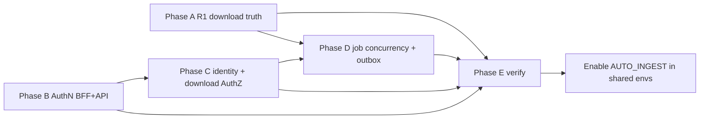

# Agentic chat Critical/High security & reliability plan

## Problem

`agentic-chat-review.md` finds Option C functionally complete but **not production-safe**. Critical/High issues let unauthenticated callers drive Foundry + pipeline cost, spoof identity/quota, download blobs by filename, and let failed downloads still emit processing work while job status can race or vanish after Service Bus publish.

**In-scope findings only:** R1, R2, R3, S1, S2, S3, S4 (review P0 + High reliability). Medium/Low items (R4–R10, S5–S10) are out of scope except where a Critical/High fix naturally depends on a small adjacent change.

## Current state (verified on `main`)

- `DownloadRequestHandler.Run` always `CompleteMessageAsync` and returns `DownloadedLiterature` even when `downloadSucceeded` is false (`src/BioAnalyzer/BioAnalyzer.EventHandlers/DownloadRequestHandler.cs`).
- Research.Api calls `UseAuthentication`/`UseAuthorization` but registers **no** auth scheme and controllers have no `[Authorize]` (`Program.cs`, `ResearchApiDependencies.cs`).
- Chat UI gates on NextAuth session; `app/api/chat/route.ts` does **not**.
- Requester is `X-Requester-Id` / body `requestedBy` / static `AGENT_REQUESTER_ID`; `RestrictJobStatusToRequester` defaults false; quota skipped when requester empty.
- `DownloadFile` / `StorageClient.DownloadFileAsync` pass `fileName` straight to blob GET; agent still exposes `downloadFile`.
- Ingest order is **publish bus → upsert job → idempotency map**; job updates are RMW upsert with swallowed exceptions and no ETag.

## Design principles

- Stop side effects on failure before adding more features.
- Authenticate the BFF first (user session), then Research.Api as a service boundary (chat is the primary caller; Blazor App is secondary).
- Treat verified identity as the only source of `RequestedBy`; never trust client headers on public edges.
- Prefer small, testable increments that keep Aspire/dev workable (dev auth bypass or shared secret clearly labeled).
- Keep `AUTO_INGEST_ENABLED` / broad enablement gated until Phases A–C land.

## Phase A — Pipeline truthfulness (R1 Critical)

**Goal:** A failed download must not look like success and must not start chunk/embed/graph.

### Changes

1. Refactor `DownloadRequestHandler` so success and failure diverge:
   - On success: keep current path (complete trigger + emit `DownloadedLiterature` to `%DocumentDownloadedTopic%`).
   - On failure (exception or unresolved OA content): mark item `Failed` (already partially done), **do not** return a processing payload, and choose an explicit Service Bus disposition:
     - Prefer **complete without output** for permanent resolve/download failures (avoid infinite retry of known-bad PMC), **or** dead-letter with reason when payload is corrupt.
     - Do **not** abandon in a way that reprocesses forever without backoff policy unless intentionally retryable (HTTP 5xx/transient).
2. Confirm the Azure Functions Worker pattern for “no Service Bus output” (nullable return, multi-output wrapper, or manual send). Today the method signature is `Task<DownloadedLiterature>` with `[ServiceBusOutput]` — change to a pattern that **suppresses** output on failure (e.g. `Task<DownloadedLiterature?>` if supported, or split trigger complete vs explicit sender).
3. Ensure job terminal state is set once on download failure and is not later flipped to `Processing` by a phantom downstream message.
4. Add handler unit/integration tests: download failure → no processing message; success → message emitted; corrupt payload → dead-letter.

### Acceptance

- Injected bad PMC / forced download failure never reaches `DocumentProcessingOrchestratorHandler`.
- Ingest job item stays `Failed` at stage `Download`.
- Successful OA PMC still flows download → processing → `GraphReady`.

### Primary files

- `src/BioAnalyzer/BioAnalyzer.EventHandlers/DownloadRequestHandler.cs`
- New tests under EventHandlers test project (create if missing)

## Phase B — Authenticate the chat BFF and Research.Api (S1, S2 Critical)

**Status:** Implemented (Entra JWT primary + optional API key; NextAuth session gate on chat).

**Goal:** Unauthenticated callers cannot hit `/api/chat` or Research.Api side-effecting surfaces.

### B1 — bioanalyzer-chat

1. Require a valid NextAuth session in `app/api/chat/route.ts` (and any other agent API routes) before Foundry/tools run; return **401** when missing.
2. Prefer shared helper / lightweight `middleware.ts` for `/api/*` so new routes do not regress.
3. Tests: unauthenticated POST `/api/chat` → 401; authenticated path still streams (mock session).

### B2 — Research.Api service auth

1. Register a real authentication scheme in `ResearchApiDependencies` / `Program.cs`. Recommended MVP for Aspire + K8s:
   - **Primary:** JWT bearer (same Azure AD tenant/app audience as chat and/or App), **and/or**
   - **Service credential:** shared API key / managed-identity-backed token for server-to-server (chat route and Blazor `ResearchApiClient`).
2. Apply `[Authorize]` (or endpoint filters) at minimum on:
   - `POST /Literature/ingest`, uploads, downloads, candidates
   - `GET /Literature/downloads/{fileName}`, `downloads/view`
   - `POST/GET /Chat/*` query/stream/evidence
   - Ingest status GET (will tighten further in Phase C)
3. Wire chat `ResearchApi` and App `ResearchApiClient` to send the service credential or user-delegated token.
4. Dev story: configuration flag for local Aspire (e.g. development auth handler or documented API key in user secrets) so `aspire start` still works without full Entra setup.
5. Do not rely on network isolation alone; auth is the application control.

### Acceptance

- Anonymous HTTP to Research.Api sensitive routes → 401.
- Chat without session → 401; with session + valid API credential → tools work.
- Blazor literature flows still authenticate to Research.Api.

### Primary files

- `src/bioanalyzer-chat/app/api/chat/route.ts`, NextAuth config, optional `middleware.ts`
- `src/bioanalyzer-chat/lib/ResearchApi.ts`
- `src/BioAnalyzer/BioAnalyzer.Research.Api/Program.cs`, `ResearchApiDependencies.cs`, controllers
- `src/BioAnalyzer/BioAnalyzer.App/Services/ResearchApiClient.cs` (and auth setup as needed)

## Phase C — Verified identity + download AuthZ (S3, S4 High)

**C1 status:** Implemented on `feature/dmaxim/reliability-updates-phase-2` (Entra principal binding).
**C2 status:** Implemented (safe fileName + download-table resolution; agent downloadFile gated off by default).

**Goal:** Requester identity is not spoofable; blob download is not an open object store by name.

### C1 — Identity binding (S3) — Entra-aware

**Auth model (post Phase B):** Research.Api accepts **Entra JWT bearer** (user delegated or daemon app role) and optionally **API key** for local Aspire. Chat obtains a user access token via NextAuth Azure AD with `RESEARCH_API_SCOPE`.

1. Derive requester **only** from authenticated principal via `RequesterIdentity.Resolve`:
   - User token: `oid:` + Entra object id
   - Daemon token: `app:` + `appid`/`azp`
   - API key scheme: `apikey:` + subject name
2. **Strip/ignore** body `requestedBy` and `X-Requester-Id` on Research.Api; controller overwrites `RequestedBy` from principal before ingest.
3. Chat must **not** send client-controlled requester headers; identity rides in the JWT (or API-key principal locally). `AGENT_REQUESTER_ID` is obsolete for AuthZ (optional logging only).
4. `RequireRequesterIdentity=true` (default): fail closed on ingest/status when identity missing; `AllowAnonymousRequester` only for explicit local break-glass.
5. When `MaxIngestJobsPerRequesterPerDay > 0`, quota requires verified identity (no anonymous bypass).
6. `RestrictJobStatusToRequester=true` (default): status reads require caller's principal identity to match `job.RequestedBy`.
7. Config matrix: `AzureAd` (JWT), `RequireRequesterIdentity`, `RestrictJobStatusToRequester`, `RequireIdempotencyKey` (Phase D).

### C2 — Blob download hardening (S4)

**Implemented:**
1. `DownloadFileName.IsValid` allow-list `^[A-Za-z0-9._-]+$` (rejects `..`, separators, empty).
2. `StorageClient.DownloadFileAsync` requires a matching `DownloadedLiterature` table row before blob read; unknown → 404.
3. Endpoint remains `[Authorize]`; controller maps invalid → 400, missing catalog → 404.
4. Agent tool `downloadFile` only when `AGENT_BLOB_DOWNLOAD_TOOL_ENABLED=true` (default **off**). Blazor/App HTTP download unchanged.

### Acceptance

- Client-supplied `requestedBy` cannot change quota bucket or unlock another user’s job status when restriction is on.
- Path-traversal / arbitrary blob key attempts fail validation.
- Agent cannot pull arbitrary blobs via tool in default flag set.

### Primary files

- `LiteratureController.cs`, `LiteratureIngestService.cs`, `LiteratureExpansionConfiguration.cs`
- `StorageClient.cs` (Research.Api)
- `src/bioanalyzer-chat/lib/ResearchApi.ts`, `ResearchTools.ts`, feature flags

## Phase D — Job status concurrency + durable ingest publish (R2, R3 High)

**Status:** Implemented (ETag job updates; job-first publish; idempotency fingerprint; stable chat keys).

**Goal:** Status plane trustworthy under concurrent PMC items; no “messages without job” / easy duplicate storms.

### D1 — Optimistic concurrency for job updates (R2)

1. Change `IngestJobStatusClient.MarkItemProgressAsync` to ETag-conditional update with retry (read → merge item → replace with `If-Match`).
2. Stop swallowing permanent failures silently: log + metric/counter; optional rethrow for caller awareness where appropriate.
3. Alternative if ETag fights too hard: **per-item table rows** + job rollup entity (clearer under high concurrency); pick one approach and stick to it.
4. Tests: two concurrent item updates both visible; no lost `GraphReady`/`Failed`.

### D2 — Job-first / outbox publish (R3)

1. Reorder `LiteratureIngestService.RequestIngestAsync`:
   - Create job row `Accepted` (and idempotency reservation) **before** or atomically with publish intent.
   - Publish Service Bus messages after durable job write.
   - On publish partial failure: mark job/items failed or retryable; avoid silent orphan messages without job when possible.
2. Split oversized batches if needed (EventBusClient); do not all-or-nothing lose the whole job without status.
3. Require idempotency key in non-dev (`RequireIdempotencyKey=true`); chat should send a **stable** key per turn (`hash(userSubject, query, sorted pmcIds)`) instead of fresh UUID every call.
4. Store request fingerprint with idempotency map; **409** on same key + different body.
5. Tests: crash/reorder simulation (job exists before bus); idempotent replay; fingerprint mismatch.

### Acceptance

- Concurrent multi-PMC job reaches correct terminal `Partial`/`GraphReady`/`Failed`.
- Kill-after-publish-before-job no longer the default failure mode (job exists first).
- Retries with same key do not double-enqueue; different body same key conflicts.

### Primary files

- `IngestJobStatusClient.cs`, table entity models, `ITableContext` usage
- `LiteratureIngestService.cs`, `EventBusClient.cs` (Research.Api)
- Chat ingest tool / `ResearchApi.requestLiteratureIngest`

## Phase E — Verification gate (blocking for enablement)

**Status:** Gate artifacts delivered. Automated suite green locally (43 .NET + 2 chat). Manual/Aspire E1–E9 still required before shared auto-ingest.

**Goal:** Prove Critical/High fixes before turning on shared-env auto-ingest.

### Delivered
1. **Automated CI:** `.github/workflows/test-reliability-hardening.yml` runs `dotnet test` + chat `npm test` on relevant PRs/pushes.
2. **Verification checklist:** `docs/agentic-chat-hardening-verification.md` (E1–E9 + link to eval checklist) with recorded automated results.
3. **Production defaults:** `docs/agentic-chat-production-defaults.md` (flags, AuthN, identity, Key Vault ownership, enablement sequence).
4. Auth matrix remains in `docs/agentic-chat-auth-config.md`.

### Still required before prod AUTO_INGEST
- Complete manual/Aspire rows E1–E9 in the verification checklist
- Confirm Entra + Key Vault secret ownership (UI client id ≠ Research API resource id)
- Turn on auto-ingest only after sign-off table is filled

## Sequencing and dependencies

- **A** can ship independently (highest reliability ROI, no auth dependency).
- **B** before **C** (identity restriction without auth is theater).
- **D** can overlap late **B/C** but should land before broad auto-ingest.
- Do **not** enable shared `AUTO_INGEST_ENABLED` until A + B + C1 minimum; full shared enablement after D + E.

## Explicit non-goals (this plan)

- Medium findings: quota table-scan redesign (R4), dual PMC resolver library (R5), hard expansion-round lock (R6), GraphReady lag (R7), PII log scrubbing (R8), SSE done fix (R9), full metrics/UX polish (P2).
- Prompt-injection hardening beyond existing flags (S5/S7) except host allow-list if touched while validating ingest links during D2.
- New product features (real `/downloads` UI, optional query-after-ingest API).

## Suggested delivery slices

| Slice | Outcome |
|-------|---------|
| A | Failed downloads cannot poison processing |
| B | Session + API auth on side-effect routes |
| C | Real requester + safe downloads |
| D | Trustworthy jobs + safer publish/idempotency |
| E | Eval evidence + prod flag matrix |
